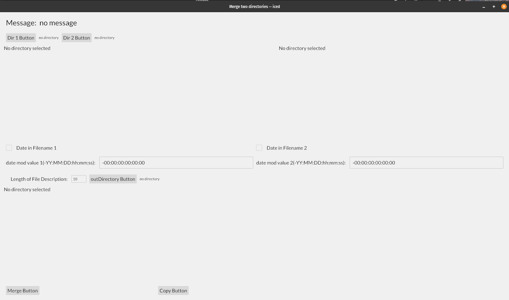

# merge2dirs
Rust-Iced program to create a merge folder from 2 other folders with pictures.

I converted one function in photoomc04 from using gtk4 to iced. Iced is still being developed and the use of progress bar is very hard to implement.

